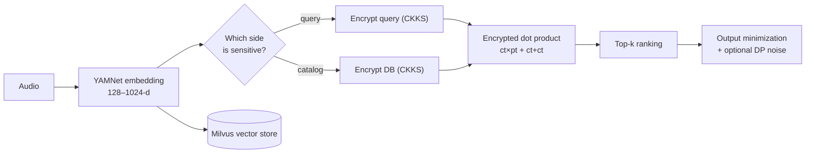

# Homomorphic Music Retrieval

Privacy-preserving similarity search over music embeddings. The core idea: **encrypt only one operand** — the query *or* the catalog — and similarity search reduces to ciphertext **addition** and ciphertext × **plaintext** multiplication. That avoids the ciphertext × ciphertext multiplies and bootstrapping that make full FHE impractical, while preserving exact nearest-neighbor rankings.

Companion code for *Balancing Privacy and Efficiency: Music IR via Additive Homomorphic Encryption* ([arXiv:2508.07044](https://arxiv.org/abs/2508.07044)).

## Architecture



## What's inside
- **Additive HE** via Microsoft **TenSEAL** (CKKS restricted to additive ops) + a true-additive **Paillier** baseline.
- **YAMNet** embeddings (128 / 256 / 512 / 1024-d); **Milvus** vector store.
- Datasets: MagnaTagATune, FSDD, ESC-50, FMA.
- **Benchmark suite:** fidelity, runtime, memory, and a security study (two music-specific inference attacks + differential-privacy mitigations).

## Results (headline)
| Metric | Result |
|---|---|
| Ranking fidelity vs plaintext | Recall@10 / nDCG@10 / Spearman = **1.000** |
| Runtime | **linear in catalog size**, ~flat in dimension |
| Peak memory (encrypted DB, N=10k) | **~5.9 GB** (encrypted-query stays ~tens of MB) |
| Attack AUC (no mitigation) | **0.80** (FSDD) / **0.94** (ESC-50) |

## Layout
- `src/` — core method implementations (AHE query/db, FHE dot/cosine/euclidean, plaintext base)
- `benchmarks/` — scaling + fidelity sweeps and the security study: `scale_benchmark.py`,
  `fidelity_benchmark.py`, `bench_common.py` (the CKKS benchmark engine, also home to the Paillier
  baseline), `run_fsdd_security.py`, `esc50_security.py`, `security_experiments.py`,
  `extract_embeddings.py` — see `benchmarks/README_benchmarks.md` for the full walkthrough
- `experiments/` — per-dataset/per-dimension run scripts: Milvus ingestion (`milvus_*.py`),
  per-dataset AHE/FHE runs (`*_fsdd_*.py`, `*esc50*.py`, `*fma*.py`), job-runner shell scripts,
  and a couple of superseded-but-kept variants (`fhe6_variant.py`, `ckks_repeated_add_variant.py`,
  `legacy_single_track.py`); `experiments/scratch/` holds one-off debugging/inspection utilities
  (Milvus connection checks, accuracy/recall probes) that aren't part of the paper's pipeline
- `paper/` — manuscript (`main_kdd.tex`) + bibliography (`mybibliography_additions.bib`)
- `results/` — small CSV outputs (tracked in git — they're tiny and are the evidence behind the
  paper's tables/figures); big data (audio, `.npy` embeddings, `milvus_demo.db`) stays gitignored

## Data
Raw audio, `.npy` embeddings, `recovered_embeddings/`, and `milvus_demo.db` are gitignored — the
repo tracks code and the small CSV evidence in `results/`, not GBs of audio/embeddings. If you
don't have `recovered_embeddings/` locally, regenerate it from a `milvus_demo.db` snapshot:
```bash
python benchmarks/extract_embeddings.py --db milvus_demo.db --out recovered_embeddings
```

## Run
```bash
pip install -r requirements.txt

# scale_benchmark.py imports bench_common.py as a sibling module and reads recovered_embeddings/
# relative to the working directory, so run it from inside benchmarks/
cd benchmarks
python scale_benchmark.py --methods ahe_query ahe_db --dims 256 --Ns 300 1000 3000
```
